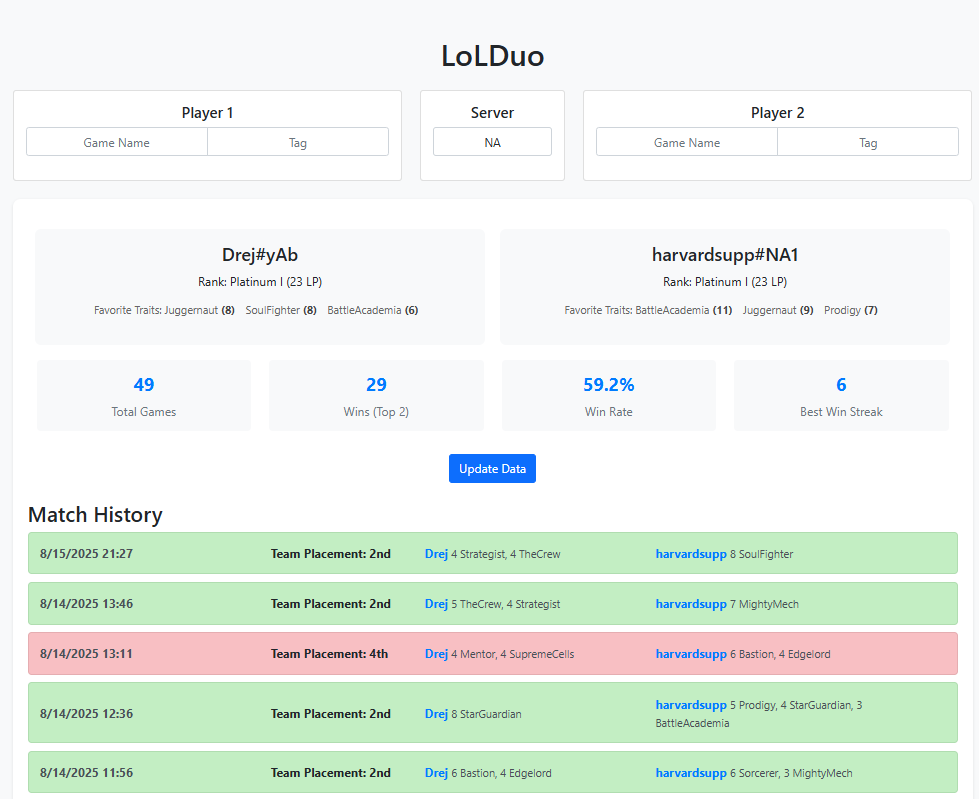

# LoLDuo
## Background
Double Up is a game mode in Team Fight Tactics (TFT), which is a game from Riot
Games. This game mode can be played alone with a random partner or with a 
selected teammate. 

## Description
This project allows users to view their Double Up statistics with a selected
teammate. It utilizes the Riot Games API to fetch match history of one player,
and filters out games that are played in the Double Up mode and also in which
the other player is their teammate. This addresses a gap in existing stat 
trackers that lack teammate-specific insights.

## Contributors
- Ondrej Vesely – Author

## Demo

